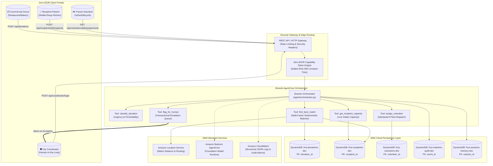
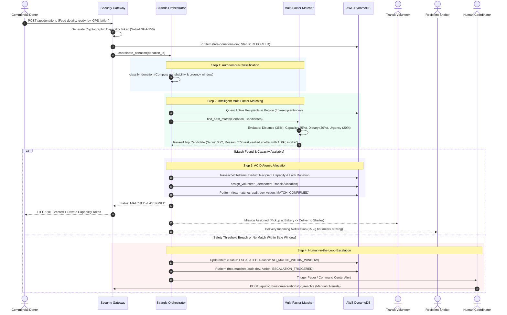
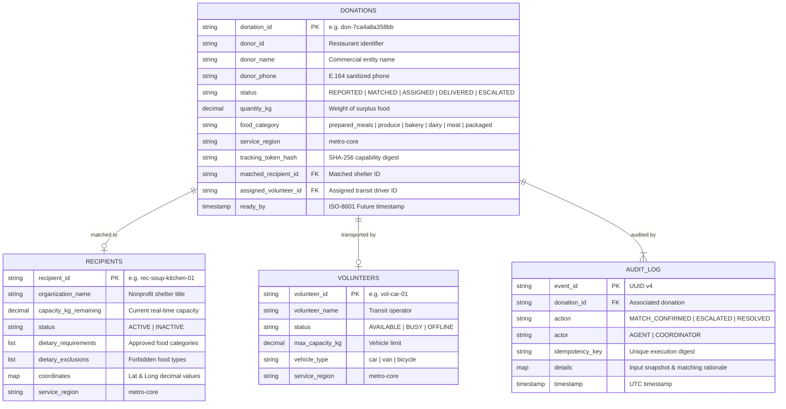
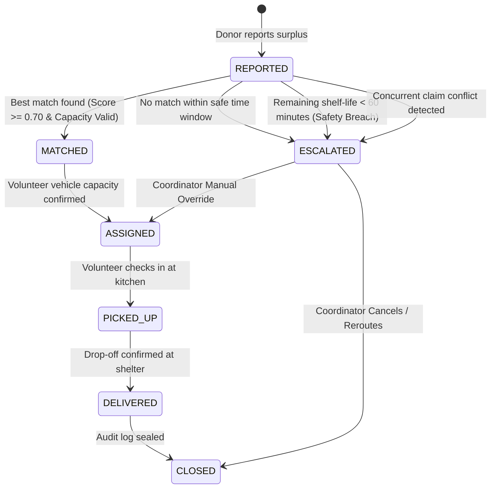

# System Architecture — Surplus Router (Good Neighbor Agent)

Surplus Router is an autonomous coordination agent built on the **Strands Agents SDK** and deployed on **Amazon Bedrock AgentCore**. It is architected for the **Good Neighbor Agents** track to eliminate the daily operational busywork of community food recovery by autonomously matching surplus food from commercial donors to community recipient organizations (shelters, soup kitchens, food pantries) and dispatching transit volunteers.

---

## 1. High-Level Architecture

The system operates as an autonomous event-driven state machine where human intervention is reserved exclusively for unrecoverable exceptions and safety-critical threshold breaches.



---

## 2. End-to-End Coordination Lifecycle

When a commercial donor reports surplus food, the agent coordinates the entire match within milliseconds using atomic database transactions.



---

## 3. Multi-Factor Matching Algorithm

The agent uses a mathematically rigorous, deterministic scoring formula that prevents arbitrary decisions and guarantees auditable outcomes:

$$\text{Total Score} = w_{\text{dist}} \cdot S_{\text{dist}} + w_{\text{cap}} \cdot S_{\text{cap}} + w_{\text{diet}} \cdot S_{\text{diet}} + w_{\text{urg}} \cdot S_{\text{urg}}$$

### Scoring Parameters & Weights:

| Factor | Weight ($w$) | Objective | Metric / Function |
| :--- | :--- | :--- | :--- |
| **Distance ($S_{\text{dist}}$)** | **0.35** | Minimize transit time & fuel | Linear inverse decay over service radius ($1.0 - \frac{d}{d_{\text{max}}}$) |
| **Capacity ($S_{\text{cap}}$)** | **0.25** | Prevent over-allocation / waste | $\frac{\text{capacity\_remaining}}{\text{capacity\_total}}$, penalized if donation $> \text{remaining}$ |
| **Dietary Fit ($S_{\text{diet}}$)** | **0.20** | Respect shelter food constraints | 1.0 (Exact match), 0.5 (Compatible), 0.0 (Excluded category) |
| **Urgency ($S_{\text{urg}}$)** | **0.20** | Prioritize highly perishable food | Scaled by remaining hours before food safety boundary |

### Deterministic Tie-Breaking:
1. Higher Composite Score wins.
2. Equal score $\rightarrow$ Lower distance wins.
3. Equal distance $\rightarrow$ Lexicographical `recipient_id` (guarantees 100% deterministic test reproducibility).

---

## 4. DynamoDB Schema & ACID Concurrency Model

All operational tables utilize single-digit millisecond latency access patterns:



### Double-Allocation Prevention (DynamoDB `TransactWriteItems`):
To prevent race conditions where two simultaneous donations claim the same shelter beyond its capacity:
```python
# Atomic Transaction:
# 1. Update Donation with matched_recipient_id (Condition: matched_recipient_id is NULL)
# 2. Deduct Recipient remaining capacity (Condition: capacity_kg_remaining >= donation_qty)
client.transact_write_items(
    TransactItems=[
        {
            "Update": {
                "TableName": "frca-donations-dev",
                "Key": {"donation_id": {"S": donation_id}},
                "UpdateExpression": "SET #st = :m_st, #rec = :rec_id",
                "ConditionExpression": "attribute_not_exists(matched_recipient_id) OR matched_recipient_id = :null_val",
                ...
            }
        },
        {
            "Update": {
                "TableName": "frca-recipients-dev",
                "Key": {"recipient_id": {"S": recipient_id}},
                "UpdateExpression": "SET #cap = #cap - :qty",
                "ConditionExpression": "#cap >= :qty AND #st = :active",
                ...
            }
        }
    ]
)
```

---

## 5. Security Architecture (Zero-IDOR & PII Redaction)

### Cryptographic Capability Tokens
* **No Sequential IDs:** Public endpoints never expose auto-incrementing integers.
* **Token Issuance:** Upon submission, donors receive an unguessable 256-bit entropy token (`token_urlsafe(32)`).
* **Salted SHA-256 Storage:** Only the cryptographic digest is stored in DynamoDB. Incoming lookup tokens are validated using **constant-time equality** (`secrets.compare_digest`) to completely prevent timing attacks.

### Strict PII Masking:
* Donor phone numbers and exact addresses are scrubbed from system logs using regex-based structured redaction (`redaction.py`).
* Volatile coordinates are restricted to verified transit drivers and the coordinator console.

---

## 6. Human-in-the-Loop Escalation Boundaries

The autonomous agent is bounded by strict guardrails and deliberately surfaces exceptions to the human coordinator when automated safety cannot be guaranteed:



1. **Safety Threshold Breach:** If remaining shelf-life is below 60 minutes at match time, the agent halts auto-dispatch and pings the coordinator.
2. **Exhausted Regional Capacity:** If no active shelter has remaining kg capacity, the donation is placed on the priority triage queue.
3. **Audit Immutability:** Every decision—whether automated or manual—is committed to `frca-matches-audit-dev` for post-event analytics.
