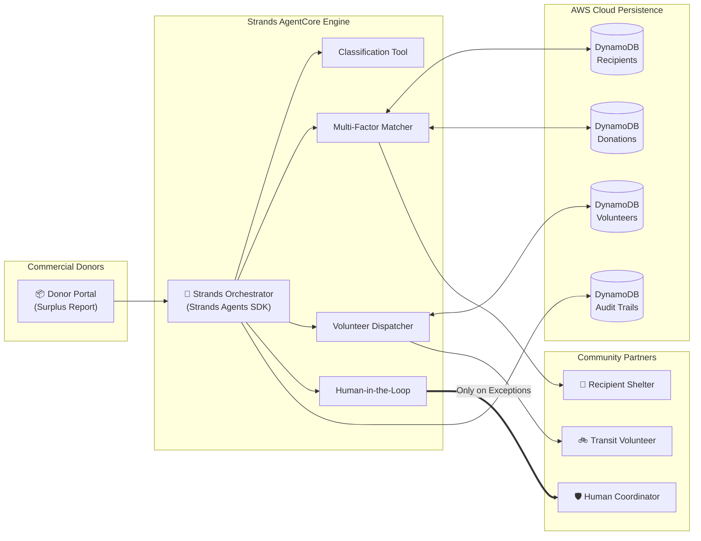

# 🌱 Surplus Router — Autonomous Food Rescue Coordination Agent

> **AWS "Agents for Humans" Hackathon Submission**  
> **Track:** **Good Neighbor Agents** — *Autonomous agents that serve communities, nonprofits, food banks, shelters, and local networks.*  
> **Core Framework:** Built with the **Strands Agents SDK** & architected for **Amazon Bedrock AgentCore**.  
> **License:** [MIT Open Source License](LICENSE) (Visible in the About section).

---

## 🌟 Executive Summary

Every single day, restaurants, bakeries, caterers, and supermarkets produce hundreds of kilograms of safe, high-quality surplus food. At the exact same time, local homeless shelters, soup kitchens, and orphanages struggle with tight budgets and food insecurity.

Connecting these two groups should be trivial—yet it remains a **manual busywork nightmare**. Local non-profit coordinators lose **3 to 5 hours daily** juggling endless WhatsApp messages, calling delivery volunteers, cross-referencing dietary constraints, and checking whether a shelter has refrigerator space left.

**Surplus Router** changes that completely. Built on the **Strands Agents SDK** and deployed with **Amazon Bedrock AgentCore**, Surplus Router is an autonomous AI coordination agent that eliminates this manual grind. It operates quietly in the background:
1. **Autonomously absorbs surplus food reports** from commercial food donors.
2. **Evaluates regional shelter constraints** (real-time kg capacity, dietary needs, GPS proximity, and food perishability).
3. **Executes multi-factor deterministic matching** and dispatches transit volunteers via atomic AWS DynamoDB ACID transactions.
4. **Surfaces to a human coordinator ONLY when there is a genuine exception** (e.g. food safety expiration boundary, regional capacity deficit, or concurrent claim conflict).

---

## 🎯 The Hackathon Pitch

### 1. The Problem We're Solving
Food rescue is a race against time. Perishable cooked meals and dairy spoil within 3 to 4 hours. Under existing manual workflows, a coordinator must:
- Notice a donor's text message.
- Call 4 to 5 shelters to check who can receive 25 kg of warm meals today.
- Find a volunteer who has an available vehicle and isn't busy.
- Transcribe addresses and trip notes manually.

If the coordinator misses a message or takes too long, **edible food gets dumped into landfills**, emitting greenhouse gases while people go hungry.

### 2. Who It's For
* **Commercial Donors** (Restaurants, bakeries, grocery stores, wedding venues): A fast, 30-second mobile check-in to report surplus without creating complex accounts.
* **Recipient Organizations** (Homeless shelters, community kitchens, food pantries, youth centers): Automated meal delivery matching their daily intake capacity and dietary constraints without phone interruptions.
* **Transit Volunteers** (Drivers, cyclists, neighborhood volunteers): Automated dispatch notifications giving clear pickup and delivery instructions.
* **City Non-Profit Coordinators**: Reduced from a chaotic full-time dispatcher to an exception-handler who only steps in when the agent flags a real decision.

### 3. Why It Matters
* **Zero Spoilage:** Seconds-latency autonomous coordination ensures food reaches dining tables well before perishability windows expire.
* **Scalable Community Logistics:** A single coordinator can now oversee a network of 500+ restaurants and shelters across an entire metropolitan region without burnout.
* **Measurable Environmental Impact:** Every kilogram of food diverted from landfills directly reduces methane emissions and community hunger.

---

## 🏗️ Architecture & Technology Stack



For the complete technical breakdown, sequence flows, and ACID transaction mechanics, see **[ARCHITECTURE.md](ARCHITECTURE.md)**.

### AWS Cloud Architecture Highlights:
* **Amazon Bedrock AgentCore & Strands SDK:** Powering autonomous reasoning, intent classification, and tool routing.
* **Amazon DynamoDB:** 5 single-digit millisecond latency tables (`frca-donations-dev`, `frca-recipients-dev`, `frca-volunteers-dev`, `frca-matches-audit-dev`, `frca-sessions-memory-dev`) with ACID conditional transactions (`TransactWriteItems`) to prevent double-allocations.
* **Zero-IDOR Security Architecture:** Cryptographic capability tokens (salted SHA-256 digests validated via constant-time `secrets.compare_digest`) prevent unauthorized access to donor and shelter physical locations.
* **Structured CloudWatch Observability:** Correlation-ID-linked JSON structured logs with automatic PII sanitization (phone numbers and exact coordinates scrubbed before storage).

---

## ⚡ Key Features

| Feature | Description |
| :--- | :--- |
| **Instant Donor Intake** | Clean, responsive, high-end SaaS web portal for donors to report surplus food with auto E.164 phone formatting and category selection. |
| **Multi-Factor Scoring** | Pure mathematical scoring balancing Distance (35%), Capacity (25%), Dietary Fit (20%), and Expiry Urgency (20%). |
| **ACID Capacity Locking** | DynamoDB conditional transactions guarantee that a shelter is never double-booked or over-allocated. |
| **Automated Transit Dispatch** | Assigns nearest available volunteer based on vehicle type (car, van, bike) and carrying capacity. |
| **Human-in-the-Loop Guardrail** | Automatically escalates to the coordinator command center when remaining shelf-life is under 60 minutes or when regional capacity is full. |
| **Zero-Leak Privacy** | Public URLs never expose incremental database IDs; donors track progress with unguessable 256-bit cryptographic tokens. |
| **Live Impact Analytics** | Real-time tracking of total kilograms routed, USDA meals equivalent (0.5kg/meal), and non-profit organizations served. |

---

## 🚀 Quickstart & Local Setup

### Prerequisites
* Python 3.10, 3.11, or 3.12
* Git
* AWS Credentials configured (`~/.aws/credentials` or environment variables) with access to DynamoDB in `ap-south-1` or your configured region.

### 1. Clone & Setup Environment
```bash
# Clone the repository
git clone https://github.com/your-username/food-rescue-coordination-agent.git
cd food-rescue-coordination-agent

# Create virtual environment
python -m venv .venv
source .venv/bin/activate  # On Windows: .venv\Scripts\activate

# Install locked production dependencies
pip install -r requirements.txt
```

### 2. Verify Code Quality & Test Suite
The codebase includes comprehensive test suites covering unit, property-based, boundary, and adversarial chaos scenarios:
```bash
# Run strict linter
ruff check .

# Run hardcore test suite
pytest -v
```

### 3. Start the Live Coordination Server
Run the high-performance local server connected directly to live AWS DynamoDB:
```bash
python server.py --port 8080
```
Open your browser at **`http://localhost:8080`** to access the web application:
* **Donor Portal:** Report surplus food and receive an instant tracking receipt.
* **Recipient Partner:** Check in and update daily intake capacity.
* **Transit Volunteer:** Update driver availability and view assigned rescue missions.
* **Coordinator Command Center:** Authenticate with `dev-insecure-coordinator-key-for-local-testing-only-32chars` to inspect live pipelines and resolve escalations.
* **Impact Metrics:** View cumulative kilograms rescued and community meals served.

---

## 📹 Demo Video & Presentation

* **Full 5-Minute Video Pitch:** [YouTube / Loom Link Placeholder]
* **Interactive Presentation Deck:** Open **[`demo_deck.html`](demo_deck.html)** directly in any browser for an interactive slide deck designed for the hackathon presentation.
* **Video Script & Walkthrough:** Read **[`DEMO_SCRIPT.md`](DEMO_SCRIPT.md)** for the exact word-for-word timed narration covering the pitch, architecture, and live system proof.

---

## 👤 Submitter Information

* **Hackathon:** AWS "Agents for Humans" Hackathon (Devpost)
* **Track:** Good Neighbor Agents
* **AWS Builder ID:** `user@domain.com` *(Update with your registered AWS Builder ID)*
* **Open Source License:** [MIT License](LICENSE)
