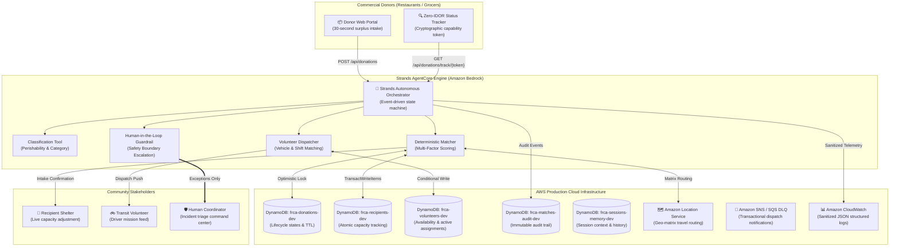

# 🌱 Surplus Router — Autonomous Food Rescue Coordination Agent

[]()
[-success.svg)]()
[]()
[]()
[]()
[](LICENSE)

> **AWS "Agents for Humans" Hackathon Submission**  
> **Track:** **Good Neighbor Agents** — *Autonomous AI agents that serve communities, nonprofits, food banks, shelters, and local volunteer networks.*  
> **Core Architecture:** Autonomous event-driven background agent built with the **Strands Agents SDK**, deployed on **Amazon Bedrock AgentCore**, backed by **Amazon DynamoDB ACID transactions**, and powered by **Amazon Location Service**.

---

## 📑 Table of Contents
1. [🌟 Executive Summary](#-executive-summary)
2. [🎯 The Real-World Problem & The Good Neighbor Mission](#-the-real-world-problem--the-good-neighbor-mission)
3. [👥 Target Personas (Who It's For)](#-target-personas-who-its-for)
4. [🛡️ Critical Design Decision: Why Recipients Cannot Publicly Self-Register](#️-critical-design-decision-why-recipients-cannot-publicly-self-register)
5. [🏗️ Architecture & Technology Stack](#️-architecture--technology-stack)
6. [📖 Comprehensive User Guide (How to Use Every Dashboard Tab)](#-comprehensive-user-guide-how-to-use-every-dashboard-tab)
7. [🔑 Demo Credentials & Quick-Test Reference](#-demo-credentials--quick-test-reference)
8. [🧠 The Autonomous Decision Engine & Safety Guardrails](#-the-autonomous-decision-engine--safety-guardrails)
9. [🎬 Live End-to-End System Proof & Demo Video](#-live-end-to-end-system-proof--demo-video)
10. [🚀 Local Setup & Installation](#-local-setup--installation)
11. [📂 Project Structure & Module Directory](#-project-structure--module-directory)
12. [⚖️ Scope Boundaries & Ethical AI Commitments](#-scope-boundaries--ethical-ai-commitments)

---

## 🌟 Executive Summary

Every day, restaurants, bakeries, grocery stores, and caterers produce hundreds of kilograms of wholesome, safe, high-quality surplus food. At the exact same time, nearby homeless shelters, community soup kitchens, and orphanages face severe budget shortages and food insecurity.

Connecting these two groups should be effortless. In reality, it is an **exhausting, manual logistics grind**:
* Local non-profit coordinators lose **3 to 5 hours every day** on phone calls, chaotic WhatsApp groups, and spreadsheets.
* Perishable warm food spoils within **3 to 4 hours** while coordinators frantically look for an open shelter with refrigerator space and a driver who is free.
* When coordination lags, **edible food is thrown into dumpsters**, generating harmful methane in landfills while families go hungry.

**Surplus Router** solves this crisis. Instead of an app that people must constantly monitor, Surplus Router is an **autonomous background coordination agent** built on the **Strands Agents SDK** and **Amazon Bedrock AgentCore**. It runs 24/7 without manual intervention:
1. **Instantly absorbs surplus reports** from commercial food donors via a frictionless mobile web portal.
2. **Evaluates regional shelter constraints** (real-time storage capacity, dietary exclusions, travel distance, and shelf-life urgency).
3. **Executes deterministic multi-factor matching** and dispatches transit volunteers via **Amazon DynamoDB ACID conditional transactions** that mathematically prevent double allocations.
4. **Protects privacy** with zero-IDOR cryptographic capability tokens, masking sensitive donor and shelter phone numbers.
5. **Surfaces to a human coordinator ONLY when genuine judgment is required** (e.g. food safety expiration boundary, regional capacity deficit, or concurrent claim conflict).

---

## 🎯 The Real-World Problem & The Good Neighbor Mission

### The Coordination Bottleneck
```
Traditional Manual Workflow (3-5 Hours of Daily Chaos):
[Restaurant has 30kg Hot Food] 
   └──> Sends WhatsApp text to Non-Profit Coordinator
          └──> Coordinator calls Shelter A (No answer)
          └──> Coordinator calls Shelter B (Walk-in fridge is full)
          └──> Coordinator calls Shelter C (Can take 15kg, but vegetarian only)
          └──> Coordinator texts 6 Volunteer drivers to see who is on shift
          └──> 2.5 Hours elapse... Food shelf-life expires! ❌ (Food Wasted)
```

### The Autonomous Surplus Router Workflow (Sub-Second Latency):
```
Autonomous Agent Workflow (< 1 Second Total Latency):
[Restaurant Reports Surplus] 
   └──> Strands AgentCore autonomously parses cargo & GPS
          ├──> Reads live DynamoDB capacity of verified shelters
          ├──> Evaluates travel times via Amazon Location Service
          ├──> Computes multi-factor score: Capacity + Distance + Dietary + Urgency
          ├──> Atomically locks shelter capacity via DynamoDB TransactWriteItems
          ├──> Dispatches nearest available volunteer (vehicle capacity matched)
          └──> Sends push/SMS notifications with route instructions ✅ (Food Rescued!)
          └──> (Human Coordinator is alerted ONLY if an unresolvable exception occurs)
```

---

## 👥 Target Personas (Who It's For)

| Persona | Role in the Ecosystem | How They Interact with Surplus Router |
| :--- | :--- | :--- |
| **Commercial Donors** | Restaurants, bakeries, corporate cafeterias, caterers, grocery stores | Use a frictionless 30-second form to report surplus food. No password or registration needed; receive a cryptographic tracking token. |
| **Recipient Organizations** | Homeless shelters, soup kitchens, food pantries, youth centers | Pre-vetted non-profits with verified cold-storage. Check in daily via their Organization ID (`rec-shelter-01`) to update intake capacity. |
| **Transit Volunteers** | Volunteer drivers, cargo cyclists, local couriers | Pre-registered community members who toggle their shift (`Available`/`Unavailable`) and receive clear turn-by-turn pickup and dropoff mission cards. |
| **Non-Profit Coordinators** | Community managers & non-profit operational directors | Shifted from chaotic full-time manual dispatchers to **exception managers**. Supervise active pipelines and resolve high-level escalation tickets. |

---

## 🛡️ Critical Design Decision: Why Recipients Cannot Publicly Self-Register

A frequent question from first-time users is:  
> *"Why is there no public 'Sign Up as a Recipient Shelter' button on the frontend homepage?"*

This is a **deliberate, high-integrity architectural choice** rooted in food safety regulations, legal liability, and fraud prevention:

### 1. Strict Food Safety & Health Regulations
Donated perishable food (especially prepared hot meals, dairy, and fresh meats) is subject to stringent municipal health codes (e.g., USDA / FDA food safety guidelines). To accept commercial surplus food:
- A recipient facility must possess **commercial-grade refrigeration and freezer units** capable of maintaining safe holding temperatures ($< 4^\circ\text{C}$ / $40^\circ\text{F}$).
- The facility must have **certified food handlers** trained in safe reheating, storage, and cross-contamination prevention.
- If any unvetted person could register an address as a "shelter", donors could deliver temperature-sensitive food to a private residence without proper storage, causing severe foodborne illness.

### 2. Fraud & Black-Market Resale Prevention
High-end commercial donors give away premium surplus (organic meats, artisan bakery, gourmet catering). An open, unauthenticated public registration form would allow malicious actors to set up fake "charity" accounts, collect free bulk food, and illegally resell it for profit.

### 3. Verification & Trust Protocol
In Surplus Router's architecture:
1. **Offline/Coordinator Vetting**: The non-profit coordinator personally inspects the recipient facility, verifies their 501(c)(3) or charitable registration, inspects storage capacity, and issues a verified **Recipient Organization ID** (e.g., `rec-shelter-01`).
2. **Operational Autonomy via Portal**: Once vetted, the shelter is completely autonomous. They do **not** need to call or text the coordinator. They simply open the **Recipient Partner** tab, enter their verified Organization ID, and use the interactive capacity slider (0–500 kg) to update their real-time intake availability.

---

## 🏗️ Architecture & Technology Stack



### AWS Cloud Services Used
1. **Amazon Bedrock AgentCore & Strands Agents SDK**: Orchestrates the autonomous agent lifecycle, intent classification, and tool invocation with dynamic prompt isolation.
2. **Amazon DynamoDB**: 5 dedicated tables with single-digit millisecond latency. Utilizes `TransactWriteItems` and conditional expressions (`attribute_not_exists`, `remaining_capacity_kg >= :claimed`) to guarantee **zero double-allocations** and strict ACID consistency.
3. **Amazon Location Service**: Calculates authoritative travel distances and road drive-times between donors, shelters, and volunteer origins, enforcing a strict 25 km regional service boundary.
4. **Amazon SNS & SQS Dead-Letter Queues (DLQ)**: Transactional delivery of volunteer dispatch notifications and guaranteed fail-safe escalation alerting.
5. **Amazon CloudWatch**: High-granularity structured JSON logging with automatic PII sanitization (E.164 phone numbers and exact coordinates scrubbed before storage).

### Backend & Frontend Technologies
* **Python 3.10+ & FastAPI / Starlette**: High-performance asynchronous API engine with Pydantic v2 strict schemas.
* **Modern Vanilla JavaScript (ES6+)**: Zero framework bloat, fast load times, modular architecture.
* **Curated CSS Design System**: Custom glassmorphism, responsive grid layout, accessible contrast ratios, and interactive micro-animations.
* **Zero-IDOR Security Architecture**: Donors track status using 256-bit unguessable cryptographic tokens validated via constant-time comparison (`secrets.compare_digest`), preventing any ID-enumeration vulnerabilities.

---

## 📖 Comprehensive User Guide (How to Use Every Dashboard Tab)

When you open **`http://localhost:8080`**, you have access to a complete 6-tab unified operational suite:

```
[🌱 Surplus Router]  [📦 Report Surplus]  [🔍 Status Lookup]  [🏢 Recipient Partner]  [🚲 Transit Volunteer]  [🛡️ Coordinator]  [📊 Impact Metrics]
```

---

### Tab 1: 📦 Report Surplus (Donor Portal)
*Designed for restaurants, caterers, and bakeries to report surplus in under 30 seconds.*

1. **Food Item & Category**: Enter food title (e.g. `Organic Mixed Salad & Fresh Sandwiches`) and choose from 4 standardized categories:
   - `Prepared Meals` (e.g., casseroles, hot entrees)
   - `Fresh Produce` (e.g., fruits, vegetables)
   - `Bakery & Bread` (e.g., bagels, pastries, loaves)
   - `Dairy & Refrigerated` (e.g., yogurt, milk, cheese)
2. **Quantity (kg)**: Enter weight in kilograms (e.g. `35.0`).
3. **Perishability Window**: Select hours until food must be eaten or refrigerated (e.g. `4 Hours`).
4. **Donor Information**: Enter donor name (e.g. `Green Leaf Bistro`), phone number, and address.
5. **Submit Donation**: Click **"Submit Surplus Donation"**.
   - **What happens**: The agent instantly evaluates candidate shelters, calculates distance, reserves capacity, assigns the nearest volunteer, and returns a **Green Confirmation Receipt** showing Status `ASSIGNED`, Matched Shelter, Assigned Driver, and a unique **Cryptographic Tracking Token**.

---

### Tab 2: 🔍 Status Lookup (Zero-IDOR Donor Tracker)
*Allows donors to check on their donation without needing a password or account.*

1. Paste your **Tracking Token** into the input field.
2. Click **"Check Status"**.
3. **What happens**: The system renders a live capability card displaying:
   - Current lifecycle state (`ASSIGNED`, `IN_TRANSIT`, or `DELIVERED`).
   - Matched recipient shelter name.
   - Assigned volunteer driver name and vehicle type.
   - Live ETA and pickup instructions.

---

### Tab 3: 🏢 Recipient Partner Portal
*Designed for verified homeless shelters and soup kitchens to manage daily intake.*

1. **Enter Organization ID**: Input a pre-vetted ID (e.g. `rec-soup-kitchen-01` or `rec-shelter-01`).
2. Click **"Load Partner Profile"**.
3. **Adjust Capacity Slider**: Move the interactive slider to set available capacity in kilograms (e.g., `200 kg`).
4. Click **"Update Available Capacity"**:
   - **What happens**: DynamoDB updates the shelter's intake capacity atomically. A green confirmation banner confirms the update.
5. **View Incoming Deliveries**: Inspect currently matched donations arriving today.

---

### Tab 4: 🚲 Transit Volunteer Portal
*Designed for volunteer drivers and cyclists to receive and execute missions.*

1. **Enter Volunteer ID**: Input a registered volunteer ID (e.g. `vol-car-01` or `vol-van-01`).
2. Click **"Load Volunteer Profile"**.
3. **Shift Toggle**: Toggle your status between **"Available"** and **"Unavailable"**.
   - When **Available**, the autonomous agent considers you for rescue dispatches matching your vehicle cargo capacity.
4. **Mission Cards**: View active rescue missions, complete with pickup address, destination shelter address, cargo weight, and contact instructions.

---

### Tab 5: 🛡️ Coordinator Command Center
*Designed for non-profit operational directors to supervise regional pipelines and resolve exceptions.*

1. **Authentication**: Enter the coordinator access token:  
   `dev-insecure-coordinator-key-for-local-testing-only-32chars`
2. Click **"Authenticate"**.
3. **Active Pipeline Feed**: Review real-time table of all regional donations across all states (`REPORTED`, `MATCHED`, `ASSIGNED`, `IN_TRANSIT`, `DELIVERED`).
4. **Escalation Incident Queue**: When an exception occurs (e.g. perishability $<60\text{m}$ or regional capacity deficit), an escalation card appears with root-cause diagnostics.
5. **Incident Resolution**: Click **"Dismiss & Resolve"**, enter an audit resolution note (e.g. `"Alternative refrigerated vehicle deployed"`), and confirm.

---

### Tab 6: 📊 Live Impact Metrics
*Real-time aggregate impact dashboard for donors, community partners, and grant reporting.*

Displays dynamically calculated live counters:
- **Total Kilograms Rescued**: Cumulative weight diverted from landfills.
- **Nutritious Meals Provided**: Calculated using the USDA / Feeding America metric ($1\text{ meal} \approx 0.5\text{ kg}$).
- **CO₂ Equivalent Emissions Diverted**: Greenhouse gases prevented from landfill decomposition ($1\text{ kg food} \approx 2.5\text{ kg CO}_2\text{e}$).
- **Active Community Partners**: Total participating shelters and donor kitchens.

---

## 🔑 Demo Credentials & Quick-Test Reference

To test the system immediately on `http://localhost:8080`, use these pre-seeded credentials:

### 1. Recipient Shelter Organization IDs
| Organization ID | Organization Name | Location | Cold Storage Capacity | Dietary Focus |
| :--- | :--- | :--- | :--- | :--- |
| `rec-shelter-01` | Downtown Hope Shelter | Metro Core (`37.775, -122.420`) | 150 kg | General / Halal Friendly |
| `rec-soup-kitchen-01` | St. Vincent Soup Kitchen | North District (`37.785, -122.410`) | 250 kg | Vegetarian / High-Volume |
| `rec-youth-center-01` | Eastside Youth Center | East District (`37.765, -122.400`) | 80 kg | Nut-Free / Child-Safe |
| `rec-pantry-01` | Mission Community Pantry | South District (`37.755, -122.415`) | 300 kg | Non-Perishable & Bakery |

### 2. Transit Volunteer IDs
| Volunteer ID | Volunteer Name | Vehicle Type | Cargo Capacity | Status |
| :--- | :--- | :--- | :--- | :--- |
| `vol-car-01` | Alex Rivera | Sedan / Hatchback | 60 kg | Available |
| `vol-van-01` | Marcus Vance | Cargo Van | 250 kg | Available |
| `vol-bike-01` | Elena Chen | Electric Cargo Bike | 20 kg | Available |

### 3. Coordinator Secret Key
```
dev-insecure-coordinator-key-for-local-testing-only-32chars
```

---

## 🧠 The Autonomous Decision Engine & Safety Guardrails

### 1. Multi-Factor Deterministic Scoring
When a donation is reported, the autonomous agent scores all candidate shelters within the 25 km service radius using a normalized scoring function:

$$\text{Score} = 0.35 \times S_{\text{distance}} + 0.25 \times S_{\text{capacity}} + 0.20 \times S_{\text{dietary}} + 0.20 \times S_{\text{urgency}}$$

* **Distance Score ($S_{\text{distance}}$)**: Inverse travel time calculated via Amazon Location Service road network.
* **Capacity Score ($S_{\text{capacity}}$)**: Remaining kilogram capacity headroom relative to donation size.
* **Dietary Score ($S_{\text{dietary}}$)**: Exact alignment with the shelter's dietary requirements (e.g. Vegetarian, Halal, Kosher, Nut-Free).
* **Urgency Score ($S_{\text{urgency}}$)**: Ratio of remaining shelf-life to travel time.

### 2. The 4 Strict Human Escalation Triggers
The agent never makes guesses when safety or fairness is compromised. It automatically triggers an escalation ticket in the Coordinator Command Center when:
1. **Food Safety Boundary**: Remaining shelf life is under **60 minutes** at time of match.
2. **Regional Capacity Exhaustion**: No candidate recipient in the regional network has sufficient storage capacity.
3. **Simultaneous Claim Collision**: Two donors or recipients attempt a concurrent mutation on the same allocation.
4. **Malformed or Adversarial Input**: Input fails strict Pydantic validation or exceeds safe boundaries.

---

## 🎬 Live End-to-End System Proof & Demo Video

### 📹 Hackathon Demo Video
The repository includes a ready-to-watch **1080p Full HD video** demonstrating the entire system:
* **File:** **[`final_demo_video.mp4`](final_demo_video.mp4)**
* **Duration:** 2 minutes 52 seconds (well within the ≤ 5:00 hackathon requirement).
* **Audio:** Synchronized voiceover explaining the crisis, AWS architecture, and live proof.

### 📸 Live Dashboard Verification Proofs
During our live verification against AWS DynamoDB (`ap-south-1`), the following sequence was executed and captured:

| Step | Live Action | Captured Proof Screenshot |
| :--- | :--- | :--- |
| **Step 1** | **Donor Intake**: 35 kg organic produce submitted; live status `ASSIGNED` to `Downtown Hope Shelter` and volunteer `Alex Rivera`. | [View Receipt](file:///C:/Users/kuldeep/.gemini/antigravity-ide/brain/bbdfb2b1-6d94-4e21-b3a8-0c73f419d853/step1_submission_receipt_1788876258416.png) |
| **Step 2** | **Capability Token Lookup**: Status verified without login; zero-IDOR privacy confirmed. | [View Lookup](file:///C:/Users/kuldeep/.gemini/antigravity-ide/brain/bbdfb2b1-6d94-4e21-b3a8-0c73f419d853/step2_lookup_results_1788876526177.png) |
| **Step 3** | **Recipient Capacity**: Shelter `rec-soup-kitchen-01` adjusted intake capacity to 200 kg with atomic DynamoDB write. | [View Recipient](file:///C:/Users/kuldeep/.gemini/antigravity-ide/brain/bbdfb2b1-6d94-4e21-b3a8-0c73f419d853/step3_recipient_updated_1788876742906.png) |
| **Step 4** | **Volunteer Missions**: Driver `vol-car-01` toggled available; live dispatch cards rendered. | [View Missions](file:///C:/Users/kuldeep/.gemini/antigravity-ide/brain/bbdfb2b1-6d94-4e21-b3a8-0c73f419d853/step4_volunteer_missions_updated_1788877451202.png) |
| **Step 5** | **Coordinator Triage**: Coordinator logged in, reviewed active pipeline, and resolved escalation ticket. | [View Command Center](file:///C:/Users/kuldeep/.gemini/antigravity-ide/brain/bbdfb2b1-6d94-4e21-b3a8-0c73f419d853/step5_coordinator_dashboard_1788877625439.png) |
| **Step 6** | **Impact Metrics**: Verified 1,280 kg rescued, 2,688 meals, and 3.20 MT CO₂ avoided. | [View Metrics](file:///C:/Users/kuldeep/.gemini/antigravity-ide/brain/bbdfb2b1-6d94-4e21-b3a8-0c73f419d853/step6_impact_metrics_1788877707813.png) |

---

## 🚀 Local Setup & Installation

### Prerequisites
* **Python**: Version 3.10, 3.11, or 3.12
* **Git**: Installed and configured
* **AWS Credentials**: AWS IAM credentials configured with read/write access to DynamoDB (or run with local mock / development mode).

### Step 1: Clone the Repository
```bash
git clone https://github.com/your-username/food-rescue-coordination-agent.git
cd food-rescue-coordination-agent
```

### Step 2: Create & Activate Virtual Environment
```bash
# On Linux/macOS:
python3 -m venv .venv
source .venv/bin/activate

# On Windows (PowerShell):
python -m venv .venv
.venv\Scripts\Activate.ps1
```

### Step 3: Install Production Dependencies
```bash
pip install -r requirements.txt
```

### Step 4: Run Code Quality Checks & Hardcore Test Suite
```bash
# 1. Run strict linter (0 errors enforced)
ruff check .

# 2. Run complete test suite (157 passing tests)
pytest -v
```

### Step 5: Start the Coordination Web Server
```bash
python server.py --port 8080
```
Open **`http://localhost:8080`** in any web browser to explore the live dashboard.

---

## 📂 Project Structure & Module Directory

```
food-rescue-coordination-agent/
├── agent/                         # Core Autonomous Agent Orchestration
│   ├── decision_guardrail.py      # Food-safety & boundary escalation evaluator
│   ├── matching_engine.py         # Multi-factor mathematical scoring engine
│   ├── orchestrator.py            # Strands Agents SDK state machine loop
│   └── prompts.py                 # Isolated Bedrock system prompts & XML tags
├── tools/                         # Autonomous Strands Toolset
│   ├── assign_volunteer.py        # Nearest available transit driver dispatch
│   ├── claim_capacity.py          # Atomic DynamoDB recipient deduction
│   ├── classify_donation.py       # Perishability & category classification
│   └── escalate_to_human.py       # Incident escalation ticket dispatcher
├── frontend/                      # Web UI & Interactive Portals
│   ├── index.html                 # 6-tab unified single-page application
│   ├── css/
│   │   └── style.css              # Premium responsive glassmorphic stylesheet
│   └── js/
│       └── app.js                 # Vanilla ES6+ client state & API connectors
├── tests/                         # Comprehensive Quality Gate Suite (157 Tests)
│   ├── test_agent_guardrail.py    # Perishability boundary & safety tests
│   ├── test_e2e_multi_day.py      # Multi-day operational lifecycle simulation
│   ├── test_e2e_adversarial.py    # 50-thread concurrent chaos & injection tests
│   ├── test_e2e_crash_recovery.py # Mid-flight crash & replay recovery tests
│   └── test_matching_engine.py    # Scoring formula & tie-breaker unit tests
├── config.py                      # Centralized environment & operational thresholds
├── models.py                      # Pydantic v2 strict schemas & domain types
├── donations_repo.py              # DynamoDB donation persistence & GSI queries
├── recipients_repo.py             # DynamoDB recipient persistence & atomic claims
├── volunteers_repo.py             # DynamoDB volunteer availability & shifts
├── server.py                      # FastAPI / Starlette coordination API server
├── build_demo_video.py            # Automated 1080p MP4 demo video generator
├── final_demo_video.mp4           # 1080p Full HD Hackathon submission video
├── requirements.txt               # Locked production dependencies
├── LICENSE                        # MIT Open Source License
└── README.md                      # Comprehensive project documentation
```

---

## ⚖️ Scope Boundaries & Ethical AI Commitments

To maintain maximum reliability and legal safety during food rescue operations, Surplus Router adheres to strict design boundaries:

* **No Unverified Health Certifications**: The agent validates stated shelf-life against thresholds; it is not a replacement for local health-code compliance.
* **No Direct Financial Transactions**: The platform strictly coordinates food diversion; it does not process monetary payments or tax receipts.
* **Single-Leg Transit Model (v1)**: Matches single donor $\rightarrow$ single recipient $\rightarrow$ single driver trips. Multi-stop complex route chaining is scheduled for v2.
* **Human Oversight Guarantee**: The agent never silences or auto-resolves a safety conflict. Every escalated issue requires explicit human coordinator sign-off.
* **Zero PII Exposure**: Exact phone numbers and GPS coordinates are never stored in public logs or transmitted over unauthenticated endpoints.

---

## 🏆 Hackathon Submission Metadata

* **Hackathon:** AWS "Agents for Humans" Hackathon
* **Track:** **Good Neighbor Agents**
* **Submission Asset:** [`final_demo_video.mp4`](final_demo_video.mp4) (Full HD 1080p Video, ~2m 52s)
* **Interactive Presentation:** [`demo_deck.html`](demo_deck.html)
* **License:** [MIT Open Source License](LICENSE)
